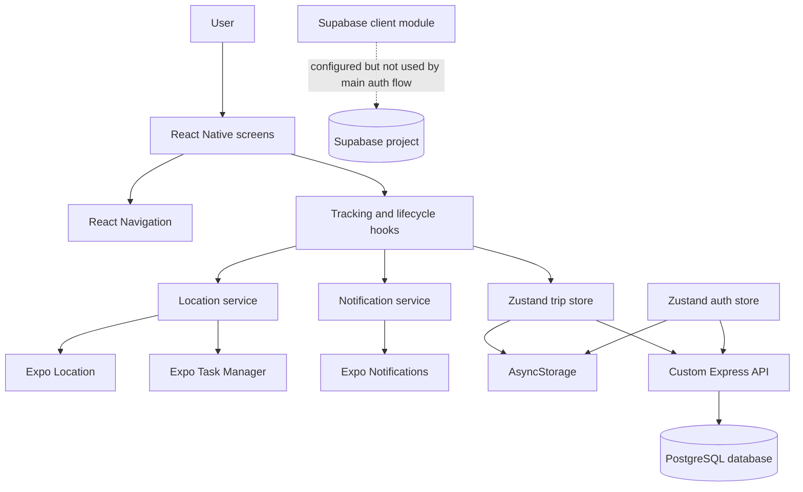
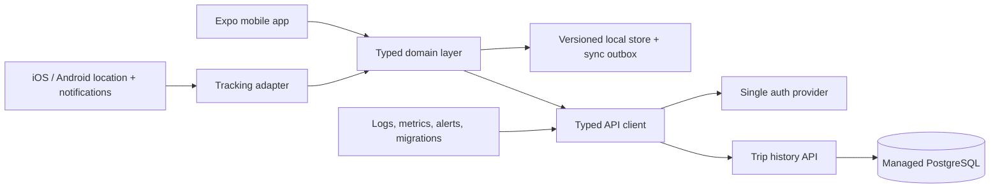

# WakeWay Architecture and Production Readiness Review

**Review date:** 2026-09-19  
**Scope:** React Native/Expo mobile app, Express backend, PostgreSQL/Supabase-hosted database, build configuration, tests, and deployment notes.

## Executive Summary

WakeWay is a location-based alarm application. The mobile client lets a user select one or more waypoints, tracks device location in the foreground and background, calculates distance to the current waypoint, and raises an alarm when the device enters a configurable radius. Trip history is kept locally and is also synchronized to a custom backend for authenticated users.

The project has a useful feature base and a clear separation into screens, hooks, Zustand stores, services, and utilities. It is not production-ready yet because the system has two competing backend models, weak secret/session handling, non-atomic alarm state transitions, incomplete operational controls, and limited automated coverage around the highest-risk behavior: background location and alarm delivery.

The recommended production direction is:

1. Choose one system of record for identity and trip history.
2. Keep the mobile device as a resilient offline cache, not the authoritative source for account data.
3. Move auth/session secrets to secure storage and remove insecure defaults.
4. Make tracking and alarm transitions explicit, idempotent, and observable.
5. Add device-level release testing for foreground/background tracking, notifications, permissions, and battery behavior.
6. Establish monitored, repeatable builds and backend deployments before store release.

## Current Architecture

### Runtime components

### Mobile layers

| Layer             | Current responsibility                                                                | Main locations                                                                                                                   |
| ----------------- | ------------------------------------------------------------------------------------- | -------------------------------------------------------------------------------------------------------------------------------- |
| App shell         | Restores auth/app state, configures navigation, theme, and lifecycle                  | [src/App.tsx](src/App.tsx), [src/hooks/useTracking.ts](src/hooks/useTracking.ts)                                                 |
| Presentation      | Login/signup, trip setup, map selection, active trip, alarm, history, settings        | [src/screens](src/screens)                                                                                                       |
| Application state | Active trip, waypoint progress, location, permissions, settings, history, errors      | [src/store/useTripStore.ts](src/store/useTripStore.ts), [src/store/useAuthStore.ts](src/store/useAuthStore.ts)                   |
| Tracking          | Foreground watcher, background task, permission checks, adaptive polling              | [src/services/locationService.ts](src/services/locationService.ts), [src/tasks/backgroundTasks.ts](src/tasks/backgroundTasks.ts) |
| Alarm delivery    | Notification channels, persistent trip notification, sound, vibration, snooze/dismiss | [src/services/notificationService.ts](src/services/notificationService.ts)                                                       |
| Persistence       | Debounced JSON snapshots in device storage                                            | [src/utils/storage.ts](src/utils/storage.ts)                                                                                     |
| Domain utilities  | Haversine distance, radius checks, GPS jump checks, ETA formatting                    | [src/utils/distanceCalculator.ts](src/utils/distanceCalculator.ts)                                                               |

### Backend layers

The backend is a small Express service. It provides:

- OTP request and verification.
- JWT issuance and validation.
- Account deactivation.
- Authenticated trip-history read, insert, and delete.
- A ping endpoint intended to keep a free hosting instance awake.

Relevant files are [backend/server.ts](backend/server.ts), [backend/db.ts](backend/db.ts), and [custom_backend_schema.sql](custom_backend_schema.sql).

The repository also contains [src/services/supabase.ts](src/services/supabase.ts) and [supabase_setup.sql](supabase_setup.sql). The active auth flow does not use that Supabase client; it uses the custom API and custom `users` table instead. The two SQL scripts describe different ownership and security models, so they must not both be treated as the production schema.

## Important Runtime Flows

### App startup

1. `useAppLifecycle` checks permissions, requests notification permission, creates notification channels, and installs app-state/notification listeners.
2. `App` restores the JWT/user session.
3. `App` restores local trip/settings state.
4. Navigation renders the authenticated or unauthenticated tree.

There is no visible startup error boundary or explicit failure state if restoration fails. The app can render only after the async initialization path completes.

### Trip tracking

1. The user selects waypoint(s) and creates a trip through the trip store.
2. Foreground tracking uses `Location.watchPositionAsync` with high accuracy and a one-second/one-meter configuration.
3. Background tracking registers an Expo Task Manager task using a lower-frequency configuration.
4. Each update writes the current location, recalculates distance, refreshes the persistent notification, and checks the current waypoint radius.
5. Entering the radius calls `triggerAlarm` and `notificationService.triggerFullAlarm`.

The foreground callback and background task duplicate alarm decision logic. This increases the chance that the two paths diverge over time.

### Trip completion and synchronization

When a trip ends, the mobile store:

- Appends a history entry to local storage.
- Updates the local trip array.
- Removes the active trip snapshot.
- Sends a best-effort `POST /api/trips/history` request when a token is present.

The sync request is not retried, queued, deduplicated, or reconciled. A temporary network failure can therefore leave local and server history inconsistent.

## Verified Production Risks

### P0: Security and account integrity

1. **JWT fallback secret is unsafe.** [backend/server.ts](backend/server.ts) falls back to a known literal secret when `JWT_SECRET` is missing. A production server must fail closed during startup instead.
2. **Auth tokens are stored in AsyncStorage.** [src/store/useAuthStore.ts](src/store/useAuthStore.ts) stores the JWT in unencrypted device storage. Use platform-backed secure storage and rotate/revoke tokens.
3. **OTP generation and verification need abuse controls.** OTP requests have no visible rate limit, attempt limit, cooldown, or abuse monitoring. OTP records are stored as plaintext codes.
4. **CORS is unrestricted.** `cors()` currently allows every origin. Restrict origins or disable browser access if the API is mobile-only.
5. **Database TLS is not verified.** [backend/db.ts](backend/db.ts) uses `rejectUnauthorized: false`. Configure a trusted CA or provider-managed verified TLS.
6. **Secrets/default credentials are present in source/config.** [src/services/supabase.ts](src/services/supabase.ts) contains fallback project credentials. Public Supabase anon keys are not equivalent to server secrets, but production configuration should still be explicit and environment-specific.

### P0: Alarm reliability and data correctness

1. **Alarm state is not persisted consistently.** `triggerAlarm` updates `activeTrip` but does not update the matching trip in `trips` or persist the active trip snapshot. A process kill immediately after triggering can lose the alarm state.
2. **Alarm triggering is not a single idempotent operation.** Foreground and background handlers can both detect the same radius entry and both invoke the alarm service. The boolean guard reduces duplicates but is not an atomic cross-path transition.
3. **Location validation is documented but not consistently applied.** The background handler does not visibly call `isValidCoordinate` or `isLocationJump` before updating state and evaluating the alarm.
4. **Background execution is OS-dependent and unverified.** Android manufacturers, iOS permission states, force-stop behavior, battery optimization, notification settings, and app termination can all affect delivery. This must be validated on physical devices.
5. **The current waypoint is not visibly advanced after an alarm.** Multi-waypoint behavior needs an explicit product decision: stop at the first waypoint, advance after dismissal, or complete the route.

### P1: Architecture and maintainability

1. **Two backend contracts exist.** The custom backend schema uses `public.users`; the Supabase script references `auth.users`. Select one contract and remove or clearly archive the other.
2. **Business rules live in a large Zustand store and duplicated hooks/services.** Extract trip transitions and alarm evaluation into a domain service with deterministic inputs/outputs.
3. **Network calls are embedded in stores.** Add an API client with timeout, status parsing, auth refresh/retry policy, request IDs, and a typed contract.
4. **Local storage is an unversioned JSON snapshot.** Add schema versioning, migrations, per-user namespacing, corruption recovery, and a durable outbox for unsynced history.
5. **Types are weakened by `any` and runtime `require`.** Replace with typed navigation params, typed service results, and static imports where possible.

### P1: Release and operations

1. The root scripts do not include a backend type-check, backend test suite, integration test, dependency audit, or release build check.
2. Existing tests focus on distance utilities. There are no repository tests for auth, trip persistence, sync retry behavior, permission denial, background tasks, notification actions, or alarm idempotency.
3. `app.json` contains duplicated Android permissions and duplicated iOS `location` background modes. Clean the configuration and verify generated native manifests.
4. The current deployment notes are aspirational in places and include commands/configuration that should be verified against the actual Expo SDK/EAS setup before use.
5. There is no documented migration/backup/restore process for the production database, no structured backend logging policy, and no health/readiness distinction.

## Recommended Target Architecture

### Recommended ownership rules

- **Domain layer:** decides whether a location update is valid, which waypoint is active, whether the alarm transition is allowed, and what side effects are required.
- **Tracking adapter:** converts Expo location events into typed domain events. It does not contain product rules.
- **Notification adapter:** performs sound/vibration/notification actions and reports failures. It does not decide whether a trip is in range.
- **Local repository:** stores the active trip and pending sync operations with versions and timestamps.
- **API client:** owns authentication headers, timeouts, retries, idempotency keys, and response validation.
- **Backend:** validates all request fields, authorizes by user ID, enforces database constraints, and records audit/operational events.

## Prioritized Change Register

### Phase 0: Blockers before any public release

- [ ] **SEC-01:** Remove the JWT fallback secret. Validate `DATABASE_URL`, `JWT_SECRET`, email configuration, and runtime environment during backend startup; exit with a clear error if missing.
- [ ] **SEC-02:** Move mobile tokens to `expo-secure-store`; define token expiry, refresh/re-authentication, logout invalidation, and account-deletion behavior.
- [ ] **SEC-03:** Add OTP request cooldowns, per-email/IP rate limits, maximum verification attempts, one-time-use enforcement, and hashed OTP storage.
- [ ] **SEC-04:** Restrict CORS, add request body size limits, validate email/OTP/trip payloads, and add security headers.
- [ ] **SEC-05:** Enable verified database TLS and use a least-privilege database role.
- [ ] **REL-01:** Decide whether Supabase Auth or the custom backend owns auth and history. Remove the unused path from the release build and keep exactly one authoritative schema/migration path.
- [ ] **ALM-01:** Implement one idempotent `evaluateLocationForTrip` domain function used by foreground and background tracking.
- [ ] **ALM-02:** Persist the alarm transition immediately and make the notification operation safe to repeat using a stable trip/alarm identifier.

**Exit criteria:** no insecure production defaults; a single auth/data model; repeated location events produce one alarm transition; cold-start recovery preserves an active/alarmed trip.

### Phase 1: Reliability and data consistency

- [ ] **DATA-01:** Add local storage versioning and migrations. Namespace all local keys by user ID, and clear only the correct user’s data on logout/deactivation.
- [ ] **DATA-02:** Add an offline sync outbox with idempotency keys, retry/backoff, dead-letter visibility, and reconciliation after login/startup.
- [ ] **DATA-03:** Add server-side unique constraints for `(user_id, trip_id)` and validate timestamps, waypoint structure, radius bounds, and payload size.
- [ ] **LOC-01:** Apply coordinate validation, accuracy filtering, timestamp ordering, and jump detection before alarm evaluation.
- [ ] **LOC-02:** Define behavior for denied/revoked permissions, force-quit, battery optimization, stale GPS, airplane mode, and notification denial.
- [ ] **LOC-03:** Define and test multi-waypoint progression, snooze semantics, dismissal semantics, and trip completion semantics.
- [ ] **API-01:** Introduce a typed API client with timeout, normalized errors, request IDs, and consistent handling of 401/429/5xx responses.

**Exit criteria:** offline completion eventually syncs exactly once; invalid/stale location updates cannot trigger an alarm; every user-visible failure has a recoverable state.

### Phase 2: Test and release foundation

- [ ] **TEST-01:** Add backend unit tests for OTP lifecycle, JWT middleware, authorization, validation, and deactivation.
- [ ] **TEST-02:** Add store/domain tests for trip creation, persistence, alarm idempotency, snooze, dismissal, waypoint progression, and restore-after-kill.
- [ ] **TEST-03:** Add API integration tests against an isolated test database.
- [ ] **TEST-04:** Add physical-device test cases for iOS and Android foreground/background tracking, permission variants, notification actions, cold start, force quit, and battery optimization.
- [ ] **TEST-05:** Add CI checks for mobile type-check/lint/test, backend type-check/test, dependency audit, and production bundle/build.
- [ ] **CFG-01:** Remove duplicated native permissions/modes and verify the generated manifests for each release profile.
- [ ] **CFG-02:** Create explicit development, staging, and production EAS profiles with separate API URLs, bundle identifiers where appropriate, secrets, and update channels.

**Exit criteria:** the release pipeline is repeatable and blocks publication when required checks fail; high-risk alarm flows have automated and device evidence.

### Phase 3: Observability, privacy, and scale

- [ ] **OPS-01:** Add structured JSON logs with request IDs and redaction. Never log OTPs, JWTs, full email addresses, or precise location unless explicitly justified.
- [ ] **OPS-02:** Add crash reporting and performance monitoring with environment/release tags and location/alarm-specific breadcrumbs.
- [ ] **OPS-03:** Add backend health and readiness endpoints, database pool metrics, alerting, and deployment rollback documentation.
- [ ] **OPS-04:** Add database backups, restore drills, migration versioning, retention policy, and data deletion verification.
- [ ] **PRIV-01:** Publish a precise privacy policy and retention/deletion model for location, trip history, account, crash, and analytics data.
- [ ] **PERF-01:** Measure battery use, location update frequency, notification latency, startup time, and memory on representative devices before setting release thresholds.
- [ ] **SCALE-01:** Replace the free-tier keep-alive workaround with an appropriate hosted service and autoscaling/availability plan before meaningful user growth.

## Suggested API Contract

Use a versioned API prefix, for example `/api/v1`.

| Endpoint                 | Purpose                                  | Required controls                                                |
| ------------------------ | ---------------------------------------- | ---------------------------------------------------------------- |
| `POST /auth/otp/request` | Request sign-in/signup/deactivation code | Rate limit, normalized email, generic response where appropriate |
| `POST /auth/otp/verify`  | Consume OTP and issue session            | Attempt limit, one-time use, session metadata, audit event       |
| `POST /auth/logout`      | Revoke current session                   | Token/session revocation                                         |
| `POST /auth/deactivate`  | Confirm and delete account               | Re-authentication, transaction, deletion audit                   |
| `GET /trips/history`     | List current user history                | Pagination, ownership filter, response schema                    |
| `POST /trips/history`    | Idempotently sync completed trip         | Idempotency key, payload validation, unique constraint           |
| `DELETE /trips/history`  | Delete current user history              | Explicit confirmation, audit event, retention policy             |
| `GET /health/live`       | Process liveness                         | No dependency requirement                                        |
| `GET /health/ready`      | Dependency readiness                     | Database/config checks, safe diagnostic output                   |

## Data Model Direction

Use one migration-managed schema. At minimum:

- `users`: account identity and lifecycle status.
- `sessions`: hashed refresh/session tokens, expiry, revocation time, device metadata.
- `otp_challenges`: hashed code, purpose, expiry, attempt count, consumed time, request metadata.
- `trip_history`: user ownership, stable client trip ID, timestamps, alarm outcome, serialized waypoint snapshot, and unique idempotency constraint.
- `audit_events`: security-sensitive account and authentication actions without secrets.

Do not rely on a SQL editor script being the migration system. Use versioned migrations and run them as part of deployment with backup and rollback procedures.

## Documentation and Repository Cleanup

- Mark the current [ARCHITECTURE.md](ARCHITECTURE.md) as superseded by this review or rewrite it to match the selected backend model; it currently describes intended flows that are not fully implemented.
- Align [DEPLOYMENT.md](DEPLOYMENT.md) with the actual Expo SDK 50/EAS configuration, current app identifiers, and verified commands.
- Add a `backend` README covering environment variables, migrations, local development, health checks, and deployment.
- Add `.env.example` files containing names only, never real credentials.
- Add a release runbook covering staging sign-off, database migration, EAS build, store submission, monitoring, rollback, and incident response.
- Record supported iOS/Android versions and the exact device matrix used for background-location verification.

## Definition of Production Ready

WakeWay should not be called production-ready until all of the following are true:

- The authentication and database ownership model is singular, explicit, and migrated through versioned changes.
- No production secret has a source-code fallback; mobile credentials are stored securely.
- OTP abuse controls, input validation, authorization, TLS verification, CORS policy, and audit logging are enabled.
- Foreground and background location use the same tested alarm decision function.
- Alarm state is persisted atomically and notification delivery is idempotent.
- Offline trip history sync is durable and exactly-once from the server’s perspective.
- CI proves mobile/backend quality gates and a release build can be produced.
- Physical-device evidence covers permission, background execution, notification, battery, cold-start, and force-quit behavior.
- Backups, restore testing, monitoring, privacy disclosures, and rollback procedures exist and have been exercised.
